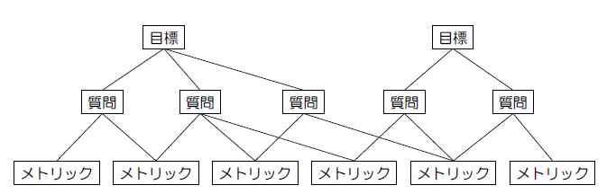

# 1章

  

## 1.1 KA：品質の概念

  

### 問題2

  

#### ディペンダビリティ（JIS Z 8115：2019）

* アイテムが、要求されたときに、その要求通りに遂行する能力

  

#### 品質の定義（ISO 9001：2015）

* 対象に本来備わっている特性の集まりが、要求事項を満たす程度

  

#### ソフトウェア品質の定義（ISO/IEC 25000：2014）

* 明示された要求下で利用するとき。明示的ニーズまたは暗黙のニーズを満たすためのソフトウェア製品の能力

  

#### Trustworthiness（ISO/IEC 30147）

* セキュリティ、プライバシー、リライアビリティ、レジリエンス、セーフティなどによって、システムがその関係者の期待に応える能力

  

---

  

# 2章

  

## 2.1 KA：ソフトウェア品質マネジメントシステムの構築と運用

  

### 問題7

  

#### TQC／TQM

* PDCAサイクルを回すことで顧客満足度の向上を図る。

* 徹底した顧客満足の追及が基本である。

* QCサークル活動など、全員参加で改善を行う。

  

#### ISO 9001：2015

* プロセスを定義してその通りに実行しているかを確認する。

  

### 問題8

  

ソフトウェアのセキュリティ評価に**コモンクライテリア（CC）およびCCのための共通評価方法（CEM）を適用**する一般的な方法

1. 開発ソフトウェアに適用すべき製品分野または技術領域ごとの公開される**プロテクションプロファイル（PP）を確認**する。

   * PP：ITやシステムなどに分類される一定の製品群のセキュリティ要件をまとめた文書である。

2. その結果にもとづいて、保証レベルと評価対象の範囲を特定する。

3. CCを参照し、**セキュリティターゲット（ST）を定義**する。

   * ST：評価対象であるIT製品やシステムが備えるべきセキュリティ機能に対する要件とその仕様をまとめたセキュリティ設計仕様書である。

4. ソフトウェア開発において、STに従ってセキュリティ機能を実装するとともにCCとCEMを参考として実装の各プロセスで、セキュリティ保証の手段が**STで定義したレベルを満たすことを保証するエビデンスを作成**する。

5. ITセキュリティ評価認証制度を利用する場合には、認証申請手続きとしてSTを認証機関に提出し、第三者表か期間による評価を受ける。評価結果について認証機関の確認を経て、そのソフトウェア製品に対する認定証を取得する。

  

## 2.2 KA：ライフサイクルプロセスのマネジメント

  

### 問題9

  

#### ISO/IEC 12207：2017

* 本規格の使用者は、使用者の目的や、組織、プロジェクト、業務の内容に合わせて、**規格内容を部分選択することやテーラリングすることが可能**である。

* 本規格は、**ソフトウェアの企画から廃棄**に至るまでのソフトウェアライフサイクルを対象としている。

* 本規格の目的として、プロセスをアセスメントして改善する国際標準**ISO/IEC 33002：2015におけるプロセス参照モデルとして活用**することを想定している。

* 本規格は、**ソフトウェア製品だけではなく、ファームウェアも対象**としている。

* 本規格は、ソフトウェアの規格から廃棄に至るまでのソフトウェアライフサイクルにわたる**30個のプロセスを整理し、4つのプロセスグループに分類**したプロセスモデルを採用している。

  

## 2.3 KA：ソフトウェアプロセス評価と改善

  

### 問題11

  

#### PSP（パーソナル・ソフトウェア：プロセス）

* 技術者に自らの生産性を計測させ、自己のプロセス能力を改善させるための訓練技法を提示している。

  

#### TSP（チーム・ソフトウェア：プロセス）

* チームリーダー、開発マネージャなどの役割別に、実施すべき活動を説いている。

* 技術者にチームで開発プロジェクトを実施する際の前提スキルや実施すべき活動を、各メンバーの役割に沿って理解させることで、チームのプロセス能力を改善することである。

* チームでソフトウェアを開発する際のポイントや工程別の留意点を学ぶことができる。

  

## 2.5 KA：監査のマネジメント

  

### 問題13

  

#### ソフトウェア品質における監査の目的

* 組織プロセスの改善

* 組織内での適切な組織規範の遵守を担保することによる信頼の付与

* プロセス遵守状況の経営者によるレビューの実施

  

## 2.6 KA：教育および育成のマネジメント

  

### 問題14

  

#### iCD（iコンピテンシディクショナリ）

* 業務（タスク）と、それを支える人材の能力や素養（スキル）を体系化している。

* 利用する企業が、それぞれのニーズや目的に合わせてカスタマイズして活用できる。

* 社員などの組織メンバーが実行能力を診断することで、個人ごとの業務状況を見える化できる。

  

#### ITSS+（ITSSプラス）

* 第四次産業革命に向けて求められるデータサイエンスやIoTソリューションといった新たな領域の学び直しに焦点をあてている。

  

## 2.7 KA：法的権利および法的責任のマネジメント

  

### 問題15

  

#### PL法（製造物責任法）

* 「製造または加工された動産」が対象となるため、プログラムだけでは対象にならない。

* 「過失」ではなく、「欠陥」の存在を立証できれば賠償を求めることができる（民事上の損害賠償請では製造者の過失を立証しなくてはならない）。

  

#### 個人情報保護法

* 個人情報を取り扱う事業者が遵守すべき義務を定めている。

  

#### 特許法

* アルゴリズムなどのアイデアを発明として保護している。

  

## 2.11 KA：構成管理

  

### 問題21

  

#### バージョン管理（版管理）

* チェックアウト：ローカル環境にリポジトリから作業用のコピーを作成する

* 更新（アップデート）：リポジトリに加えられた変更を、すでにある作業用コピーに反映させる

* チェックイン（コミット）：チェックアウト後に作業用コピーへ加えた変更をリポジトリに保存させる

* コンフリクト：1つのコードの同じ個所を異なる人が変更しようとした際に起こる現象

* ロック：指定したファイルを他の人が編集できないようにする作業

* トランク：本流の開発ツリー

* ブランチ：本流の開発ツリーとは異なる変更を加えるためのツリー

* クライアント・サーバー型：CVS、SVN

* 分散型：Git、Mercurial

  

## 2.12 KA：プロジェクトマネジメント

  

### 問題22

  

#### P2M（プロジェクト＆プログラムマネジメント）

* プロジェクトマネジメントだけでなくプログラムマネジメントも規定している。両マネジメントを通じて組織の能力や資源を効率的に活用し、組織戦略を実現することを目指している。

* 企業価値を創造する仕組みづくりへの転換を支援する。

  

#### PMBOK（Project Management Body of Knowledge）

* プロジェクトマネジメントに関するよい実務慣行などを特定することを狙っている。

  * 実際のプロジェクトでの遂行においては、PMBOKガイドで定義する知識領域以外の適用分野の知識、伊一般的なマネジメントの知識やスキル、人間関係を円滑にするスキルが必要となる。

* PMBOKガイドは、プロジェクトマネジメントの標準用語とすることで、マネジメントを遂行するうえでの共通の理解を得ることを狙いとしている。

  

## 2.15 KA：設計のマネジメント

  

### 問題26

  

#### プロジェクトの開始時点で設計方針を決めることの利点

* 計画時点で設計方針を決めて関係者全員と共有することは、ソフトウェア構造に一貫性を持たせ、要求品質を満足する設計につながる。

* 必要な時期に設計技法の選択基準や設計ルールを決めることができる。

* 設計方針は開発プロセスだけではなく保守プロセスにおいても維持され、開発プロセスに置ける利点と同様の利点がある。

* 早期に設計方針や設計技法が決定されれば、その技法に習熟した要員の確保のための時間的余裕ができるなど、設計要員の効果的な確保につながる。

  

## 2.18 KA：テストのマネジメント

  

### 問題29

  

#### テスト組織

* 出荷権限を与えることで、厳密な品質保証活動が可能になる。

* 独立性を高めることで、開発スピードを損ねることがある。

* 各テストレベルにおけるアクティビティを考慮したメンバーで構成されることが望ましい。

  

### 問題30

  

#### テスト実施段階で収集する主な情報

* テストの消化状況（実行したテストケース数など）

* 障害情報（障害密度、検出された障害数、未修整の障害数など）

* 要求、仕様やコードに対する確認の網羅性（テストカバレッジなど）

  

## 2.19 KA：品質分析および評価のマネジメント

  

### 問題31

  

#### ソフトウェア製品の品質を分析および評価する手順

1. 品質評価計画の策定

   * 評価対象、評価スケジュール、評価者などを計画する。

2. 品質目標、メトリクス、手法の定義

   * 品質に関するニーズを品質特定、副特性、メトリクスを使って定義する。

   * 定義したそれぞれのメトリクスに対して達成すべき値または範囲を品質目標値として定める。

3. 分析および評価データの取得

   * 評価対象、評価スケジュール、評価者などを計画する。

4. dsadる

   * 評価対象、評価スケジュール、評価者などを計画する。

5. ;;  

   * 評価対象、評価スケジュール、評価者などを計画する。

  
  

## 2.20 KA：リリース可否判定

  

### 問題32

  

#### 製品出荷判定

* 検査の合格にもとづいて判定するためには、その前提条件として検査自体の質が一定以上であることが保証されている必要がある。

* 保守手順が定められていることや、保守サポート部門へ必要な情報が提供されていることなど出荷以降の活動に関する事項も出荷判定基準に入れておく必要がある。

* 出荷判定責任者は、製品のプロジェクト責任者が務めるのが一般的である。

* 出荷判定で不合格になった場合でも、製品の出荷を認めることがある。

* 製品出荷判定ではなく、本番稼働移行判定を行われることがある。

  

## 2.21 KA：運用および保守のマネジメント

  

### 問題35

  

#### 適応保守（adaptive maintenance）

* 引渡し後に変化した環境においてもソフトウェア製品を変化前と同様に使用できるように保ち続けるために行うソフトウェア製品の修正

  

#### 是正保守（corrective maintenance）

* 引渡し後に発見される問題を是正するために受動的に行う修正

  

#### 予防保守（preventive maintenance）

* 引渡し後のソフトウェア製品の潜在的な障害が顕在化する前に発見し、是正を行うための修正

  

* 定義：システムやソフトウェアが将来発生しうる障害や劣化を未然に防ぐために、事前に実施する保守活動。

* 目的：故障率の低減、可用性・信頼性の向上、長期的な保守コスト削減

* 主な作業例

  * コードの静的解析ツールを用いた潜在的バグの検出

  * データベースの再構築やログのアーカイブ

  * インターフェース仕様のレビューによる要件ずれの早期発見

  * 古くなったライブラリのアップデート計画・実施

  

*  実施タイミング：障害が発生する前に定期的／計画的に行う

  

#### 完全化保守（perfective maintenance）

* 引渡し後のソフトウェア製品の潜在的な障害が、故障として現れる前に検出し訂正するための修正

  

* 定義：ユーザー要求の変化や性能向上ニーズに応じて、機能追加・改良を行う保守活動。

* 目的：機能性や性能の強化、ユーザビリティの向上、市場ニーズへの適応

* 主な作業例

  * 既存機能の高速化（アルゴリズム最適化、キャッシュ導入など）

  * UI／UXの改善（画面レイアウト変更、操作フローの見直し）

  * 新規レポート機能や分析機能の追加

  * コードのリファクタリングによる可読性・保守性向上

* 実施タイミング：ユーザーやステークホルダーからの追加要求や改善要望を受けて随時

  

# 3章

  

## 3.1 KA：メトリクス

  

### 問題37

  

#### ファンクションポイント法

* ソフトウェアアプリケーションの境界を決めたうえで顧客が利用する機能に着目して規模を定量化する。

* 測定結果は測定者によって異なることがある。

* 異なるプラットフォームや言語で開発されたシステム間の生産性の比較に応用できる。

* IFPUG（International Function Point Users Group）法をはじめとして、さまざまな測定方法がある。

* IFPUG法を基本とした簡易なMarkⅡ法や、組み込み系ソフトウェアに有効なCOSMIC-FFP法などがある。

  

### 問題38

  

#### プロダクトメトリクス

* 製品品質メトリクス

* 利用時の品質メトリクス

* 複雑度のメトリクス

* 規模のメトリクス

  

#### プロセスメトリクス

* プロセスの実施に要した時間や工数

* 投入時間または工数当たりの開発規模を表す生産性のメトリクス

  

## 3.2 KA：モデル化の技法

  

### 問題39

  

#### オブジェクト図

* インスタンス（オブジェクトの実体）の構造を表す図

  

#### ユースケース図

* システムが提供するサービス群とその利用者の関係を表す図

  

#### コンポジット構造図

* システム実行時のソフトウェア構造を表す図

  

#### クラス図

* クラスの構造を表す図

  

#### コミュニケーション図

* オブジェクト間の相互作業をオブジェクトの構造にもとづいて表す図

  

#### アクティビティ図

* アクティビティの実行順序や実行条件、実行者の関係を表す図

  

### 問題40

  

#### 離散系／連続系のモデル化技法

* 開発の早期段階で対象の振る舞いをシミュレーションできる。

* 開発のコスト面のリスクを低減できる。

* 開発の安全面のリスクを低減できる。

  

#### 離散系のモデル化

* 統一モデリング言語（UML）

  

#### 連続系のモデル化

* Simulink

* LabVIEW

  

## 3.4 KA：要求分析の技法

  

### 問題42

  

#### 製品要求

* 製品そのものに対する要求

* システムやソフトウェアが果たすべき機能に関する機能要求

* 機能面以外のもの全般に関する非機能要求

  

#### プロセス要求

* 製品要求を実現するための開発や保守の仕方に関する要求

  

## 3.5 KA：設計の技法

  

### 問題45

  

#### デザインパターン

* ソフトウェア設計の特定の文脈上で起こる問題とそれを解決するための解法などがまとめられている。

* 経験値の高くない設計者であっても保守性や再利用性の高い設計ができる。

* 実装上の冗長性を生じる可能性がある。

  

## 3.7 KA：レビューの技法

  

### 問題47

  

#### インスペクション

* 参加者の役割が明確になっており、チェクリストなど形式的な文書にもとづいて実施することや正式な記録を残すことを強調している。

  

#### テクニカルレビュー

* 技術の専門家が参加するレビューで、仕様書やソースコードなどの成果物の問題摘出を主な目的としている。

  

#### ウォークスルー

* 成果物の作成者がプログラムの処理や業務シナリオなどを説明し、参加者が成果物の説明内容に対して質問やコメントを述べる。

  

#### ラウンドロビンレビュー

* 参加者全員が順に司会者とレビューアの役を持ち回りで務め、全員が両方の視点でレビューする。

  

#### ピアデスクチェック

* 成果物の作成者に熟練者のレビューアを1名加えて実施するレビュー

  

#### チームレビュー

* チームにより実施されるレビュー

  

#### パスアラウンド

* 複数のレビューアへ成果物を配布や回覧する形態のレビュー

  

### 問題49

  

#### アドホックリーディング

* 特性の手順に従わない読み方

  

#### チェックリストベースドリーディング（CBR：Checklist-Based Reading）

* チェックリストを利用して読む技法

  

#### シナリオベースドリーディング（SBR：Scenario-Based Reading）

* 利用シナリオや品質シナリオなどにもとづいて読む技法

  

#### ディフェクトベースドリーディング（DBR：Defect-Based Reading）

* 障害が混入しやすい個所の情報を含むシナリオに沿って読む技法

  

#### パースペクティブベースドリーディング（PBR：Perspective-Based Reading）

* レビューアに特定の視点を割りあてて読む技法

  

#### ユーセージベースドリーディング（UBR：Usage-Based Reading）

* ユースケースシナリオのような利用者の利用手順と照らし合わせながら読む技法

  

## 3.8 KA：テストの技法

  

### 問題51

  

#### 状態遷移テスト

* 機能に関するソフトウェアの状態におけるテストの漏れを防止できる。

* 状態以外の事象を判断する場合はデシジョンテーブルなど、他のテスト技法と組み合わせる必要がある。

* もともとは仕様設計における設計検証技法である。

* 状態の遷移の連続回数に着目した「Nスイッチカバレッジ」が網羅基準として用いられる。

  

## 3.9 KA：品質分析および評価の技法

  

### 問題56

  

#### QC7つ道具

| 道具                           | 主な用途・特徴                                         |

| ---------------------------- | ----------------------------------------------- |

| **1. 特性要因図（フィッシュボーン・因果関係図）** | 問題（特性）の原因（要因）を整理・分析する図。「4M（人・機械・材料・方法）」などで分類    |

| **2. パレート図**                 | 不良や問題の発生頻度を多い順に棒グラフで表示し、重要項目を特定する（80:20の法則に基づく） |

| **3. チェックリスト**               | データを簡便に収集・記録するための用紙。現場の実態を可視化する                 |

| **4. ヒストグラム**                | データのばらつきや分布の状態を視覚化する棒グラフ                        |

| **5. 散布図**                   | 2つのデータの関係性（相関）を把握するために用いる。原因と結果の関係性などを視覚化       |

| **6. 管理図**                   | 時系列データを用いて工程の安定状態や異常を監視する（統計的品質管理の基本）           |

| **7. グラフ**                   | データを視覚的に分かりやすくする。棒グラフ・折れ線グラフ・円グラフなど多様           |

  
  

#### 新QC7つ道具

| 道具                    | 主な用途・特徴                                                       |

| --------------------- | ------------------------------------------------------------- |

| **1. 親和図法（KJ法）**      | 複雑で混沌とした意見や情報を、意味や関係の近さに基づいてグループ化し、体系的に整理する。ブレインストーミング後などに有効。 |

| **2. 連関図法**           | 問題と原因、原因と結果などの**因果関係を矢印で表しながら明確化**していく。複雑な問題の構造的理解に役立つ。       |

| **3. 系統図法**           | 目的を達成するための手段を\*\*「なぜならば」「どのようにして」\*\*の視点で展開し、ツリー構造で表す。        |

| **4. マトリクス図法**       | 複数の要素（例：部門×課題）を表形式で交差させ、**関係性・重要度・役割分担**などを視覚的に整理する。          |

| **5. アロー・ダイアグラム法**     | 作業の流れや順序、期間を**矢印で表現し、クリティカルパスを明確化**する。工程計画や進行管理に有効。           |

| **6. PDPC法（過程決定計画図）** | 目標に至るプロセスを段階的に展開しながら、**途中で起こり得る問題や対応策を事前に計画**する。リスク対応の設計に有用。  |

| **7. マトリクス・データ解析法**   | マトリックス図にある**数値データの相関・関係性を統計的に分析**する。多変量解析手法の一種。               |

  

# 4章

  

## 4.2 KA：セーフティ

  

### 問題62

  

#### 安全性解析

* ハザードを分類および特定し、リスクの評価を行うことで、安全度要求を策定する。また、リスクを許容範囲内に収めるために必要な安全機能を、安全機能要求として定めていく。

  

#### 開発

* 安全機能要求および安全度要求に従い、システム全体の安全性を確保できるようにソフトウェア要求分析や設計、実装を行う。

  

#### 安全性妥当性確認

* 安全度要求に応じた安全機能要求が高い信頼性で作り込まれ、想定したハザードが発生しても危険事象に至らないことを、実機を用いて実装結果を検証する。

  

# 5章

  

## 5.4 KA：クラウドサービスにおける品質

  

### 問題71

  

#### クラウドサービスの機能的合成および互換性

* サービスカスタマーでは、自動テストなどを用いた定期的な確認により互換性の問題を生じている場合に早期把握する。

* サービスカスタマーでは、サービスが停止する可能性もあるため必要に応じ代替手段を講じておく。

* サービスプロバイダーでは、インターフェースのドキュメントを実装から自動的に生成することにより、工数やミスを減らす。

  

# 第 18 回初級ソフトウェア品質技術者資格試験

  

#### CI

* 統合作業を継続的に実施するためには、手作業ではなくツールによる自動化が必要である。

* CIは、コンパイルやテスト、静的解析といった一連のビルド作業を対象としている。CIの概念をさらに発展させ、開発だけでなく本番システムへのデプロイまで対象を広げた技法としてCD（継続的デリバリー）がある。

* CIを成功させるためには、特定の統合環境でしかビルドできないような状況を避け、ビルドの環境独立性をできるだけ高める必要がある。

* CIツールによるコンパイルやテストの自動化で、結果の確認が不要になることはなく、CIツールが保持している実行結果を確認し品質状況を開発者にフィードバックすべきである。

  

#### GQM

* 目標から測定項目であるメトリクスをトップダウン的に決定するための手法である。

* 手法は目標（Goal）層、質問（Question）層、メトリック（Metric）層の3層構造で構成されるモデル化手法である。したがって、GQM 手法の適用結果は、目標－質問－メトリックの階層的な対応付けで構成される。

* GQM手法の3層の各要素間の対応関係は多対多の関係にある 。ひとつの目標は複数の質問に対応づけることもできるし、各質問は複数のメトリクスに基づいて決定されることもできる。

* GQM手法を利用すると、測定の目標とメトリクスの対応関係が明確になり、データを収集する目的の確認が容易となり、収集すべきデータが明確になる。

  

  

# 第 20 回初級ソフトウェア品質技術者資格試験 問題の解説

  

#### CFD技法

* テスト対象の入力（原因）と出力（結果）を同値に分割した同値分割図をもとに原因と結果を“流れ線” でつないだ原因流れ図（CFD）を作成し、これに基づいてデシジョンテーブルを作成してテストケースを抽出する技法である。

* CFDの作成の際にテスト対象の実装情報を用いて合理的にテストケース数を削減する、いわゆるグレーボックステストのアプローチが採られている。

* CFD 技法の目的は、複雑な論理関係を持つ仕様のプログラムに対して、網羅的でかつ少ない数のテストケースを作成することである。

* CFD 技法の効果は、同値分割図として集合論で用いられているベン図の記法を使うことにより、抽出した同値の補集合の有無がチェック でき、同値の漏れを防止できることや、実装情報を利用することにより、テストケース数が増大することを防止できることが挙げられる。

  

# 第 22 回初級ソフトウェア品質技術者資格試験

  

#### 品質計画

* 品質目標や品質を作り込む手段に関する計画が含まれ、品質の評価に関する計画も含まれる。

* 競争力のある目標を設定するために、ベンチマークにより世の中の水準や別組織のレベルと比較することも重要である。

* プロジェクトの進捗により、要求事項やプロセスが変更されることがあり、それに応じて品質計画を適宜更新する必要がある。

* 品質計画には品質目標に対する製品合否判定基準が含まれることが望ましい。

  

##### ISO 9001:2008

* 製品に対する品質目標及び要求事項

* 製品に特有なプロセス及び文書の確立の必要性、並びに資源の提供の必要性

* その製品のための検証、妥当性確認、監視、測定、検査及び試験活動、並びに製品合否判定基準

* 製品実現のプロセス及びその結果としての製品が、要求事項を満たしていることを実証するための必要な記録

  

#### ITIL（Information Technology Infrastructure Library）

* ITサービスの提供と運用管理のベストプラクティスを一貫して提供している。

* 新しいサービスの提供および既存サービスの変更を、ITサービスの設計手法に基づき、本番環境において安全に行えることを求めている。そのためにITサービスのプロセスや手順書を作成し、改善していくためのガイドラインを示している。

* ITILは、運用しているITサービスやシステムを継続的に改善すること、および効果的かつ効率的な運用管理を実現することを求めている。

* ITIL はあくまでITサービス運用のためのガイドラインであり、ソフトウェア開発に関わる内容ではない。

  

# 第 26 回初級ソフトウェア品質技術者資格試験

  

#### 構成管理の活動内容

* 複数の構成要素間の関係を管理するインターフェース管理

* 構成要素の識別と基準線（ベースライン）の設定

* 構成要素を正しい組合せで配布するリリース管理

  

#### 正準相関分析（canonical correlation analysis ）

* 観測対象から 二つ のグループの変数を観測し 、二つの変数グループ間の関係を分析する手法である。複数の変数を二つ の合成変数（特徴的な量にまとめて、その合成変数間の相関係数を最大にするような各変数の重みを求める分析法である。

  

#### 重回帰分析（multiple regression analysis）

* 一つの目的変数を複数の説明変数により分析する手法である。目的変数と説明変数間に数式を当てはめ、各説明変数の変動により、目的変数がどの程度影響されるかを分析する手法である。

  

#### 因子分析（factor analysis）

* ある観測された変数に対して、どのような潜在的な変数が影響を与えているかを探る分析手法であり、変数間の相関関係からデータに共通して影響を与えている因子を探り、変数群を潜在因子に分解し、分析する手法である。

  

#### クラスター分析（cluster analysis）

* 異なる性質を持つものの集団を特定のルールに基づいて、似たもの同士の集落（クラスター）を作り、集団を分類する手法 である。

お試し